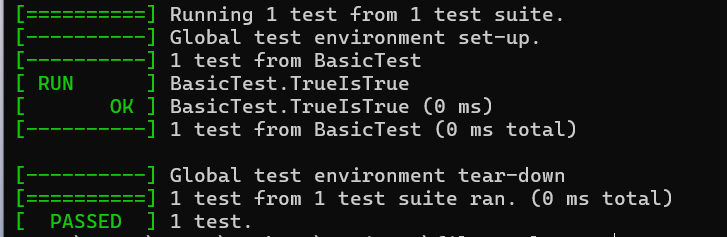

# Why Am I Doing This to Myself?
Learning Objectives:
1. Native performance optimization - Learn when/how to use C++ for heavy-lifting (file ops, data processing)
2. Multi-language integration - Bridge high-level (JS) & systems programming (C++)
3. Desktop app development with Electron - Turn web skills into desktop apps, could enhance Vesper with offline capabilities
4. Build toolchain management - Understand what's happening under the hood, debug deployment issues better
5. Systems programming concepts - Memory mgmt, file I/O, threading
    Threading here will prepare me better for future CUDA work!
6. Delve into C++ testing frameworks (gtest here) - QA at systems level

Big Picture: Make normal webdev easier by tackling hard stuff alongside Vesper development.

## Initial Setup
```bash
# 1. Initialize project
git init
npm init -y
npm install electron --save-dev

# 2. Install C++ addon tools
npm install -g node-gyp
npm install node-addon-api

# 3. Install Google Test (for C++ testing)
git clone https://github.com/google/googletest.git third_party/googletest
```

## Required Files Structure / Basic Components
```bash
file-explorer/
├── package.json       # Defines our scripts: "start": "electron ."
├── main.js            # Electron main process (creates window)
├── index.html         # UI template
├── app.js             # Renderer process (runs in browser window)
├── binding.gyp        # Build configuration for C++ addons
├── hello.cpp          # C++ code exposed to JavaScript
├── test_hello.cpp     # C++ unit tests
└── third_party/googletest/
```

3. C++ Addon Setup
```bash
npm install node-addon-api
```
    - binding.gyp   -> Build configuration (Study later)
    - hello.cpp     -> C++ code exposed to JavaScript

4. Google Test Integration
    - Updated binding.gyp   -> Multi-target build? Study later
    - test_hello.cpp        -> C++ unit tests (Dip into this more over time as we go)

5. Build & Run Workflow
```bash

# Build C++ addons and tests
node-gyp configure build

# Run the Electron app
npm start

# Run C++ tests
.\build\Release\test_runner.exe
```
REMEMBER: C++ changes require rebuilding before they show up in the app! (Cause duh)

## First Test Running to Confirm Setup! 🎉
